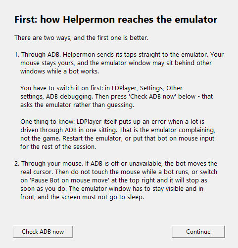
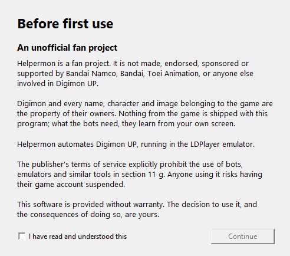
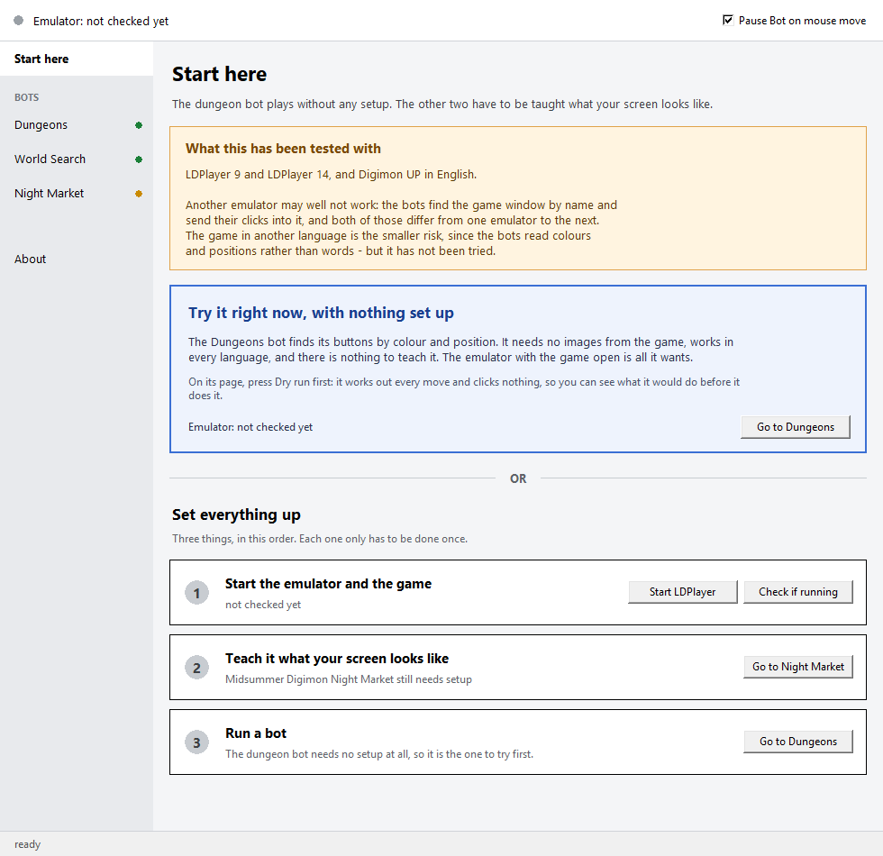

# Installing Helpermon

> **An unofficial fan project.** Helpermon is not made, endorsed, sponsored or
> supported by Bandai Namco, Bandai, Toei Animation, or anyone else involved in
> Digimon UP. *Digimon* and every name, character and image belonging to the
> game are the property of their owners. Nothing from the game is contained
> here; what the bots need, they learn from your own screen.

Helpermon plays three parts of Digimon UP for you: the dungeon list, the
**Digital World Search** and the **Midsummer Digimon Night Market**.

This page is the installation, step by step, with pictures. It takes about
fifteen minutes, and most of that is waiting for a download. What the program
does once it runs is in [QUICKSTART.md](QUICKSTART.md).

**Before you start**

* Windows 10 or 11
* LDPlayer with Digimon UP installed. Start LDPlayer **normally, not as
  administrator** — see [When Windows gets in the way](#when-windows-gets-in-the-way)
* Roughly half a gigabyte of free space
* Python is *not* a prerequisite. If you do not have it, the installer offers
  to fetch it, and it needs no administrator password

---

## 1. Download the ZIP

On this page, open **Releases** in the column on the right and take the newest
`helpermon-x.y.zip` from **Assets**.

<!-- SCREENSHOT 01: the Releases page, with the ZIP visible under Assets -->


Do not use the green **Code** button. That gives you the development tree
rather than a release, and it is a different thing.

---

## 2. Unblock the ZIP before you unpack it

Right-click the downloaded file, **Properties**, and at the bottom tick
**Unblock**, then **OK**.

<!-- SCREENSHOT 02: the Properties dialog of the ZIP, the Unblock tick at the bottom -->


This is the one step that causes trouble when it is skipped. Windows marks
every file that came from the internet, and unpacking hands that mark to every
file inside. `install.bat` then opens with a warning that its publisher could
not be verified. Unblocking the ZIP first keeps all of it quiet.

If you unpacked first and got the warning, no harm done: delete the unpacked
folder, unblock the ZIP, unpack it again.

---

## 3. Unpack it

Unpack it somewhere under your own user folder, for example
`Documents\Helpermon`.

<!-- SCREENSHOT 03: the unpacked folder in Explorer, install.bat visible -->


Not into `Program Files`, which needs administrator rights for every write, and
not left sitting in `Downloads`: what the bots learn from your screen is stored
beside the program, and you do not want to clear that out by accident when you
tidy up.

---

## 4. Double-click `install.bat`

A black window opens. It is the only time you will see one — everything after
this is a shortcut.

The installer looks for Python first. If there is none, it asks whether it
should fetch it. Answer yes and it installs into your own user folder, so
Windows does not ask for an administrator password.

<!-- SCREENSHOT 04: install.bat asking whether it should install Python -->


Then it builds a `.venv` folder beside the program and puts the packages in it.
That is a few minutes the first time. Keeping the packages in their own folder
means this cannot disturb any other Python on your machine, and uninstalling
Helpermon later is deleting a folder.

<!-- SCREENSHOT 05: the installer's last screen, shortcut created -->


---

## 5. Start it from the desktop

The installer puts a **Helpermon** shortcut on your desktop. That is what you
start from now on.

<!-- SCREENSHOT 06: the Helpermon shortcut on the desktop -->


### Prefer a terminal?

If you already keep your own Python environments, skip `install.bat` entirely:

```
py -m pip install -r requirements.txt
py app.py
```

---

## 6. Decide how Helpermon reaches the emulator

The first launch shows two dialogs. The first one decides what the next hour
looks like, so it is worth a minute.

**With ADB**, Helpermon sends its taps straight into the emulator. Your mouse
stays yours, and the emulator window may sit behind other windows. You have to
switch it on first: in LDPlayer, **Settings → Other settings → ADB debugging**.

<!-- SCREENSHOT 07: LDPlayer settings with ADB debugging switched on -->


Then press **Check ADB now** in the dialog. That asks the emulator instead of
guessing.

<!-- SCREENSHOT 08: Helpermon's first dialog, about ADB versus mouse input -->


**Without ADB**, the bot moves your real mouse. That works, with three
conditions: leave the mouse alone while a bot runs — or tick **Pause Bot on
mouse move** at the top right and it stops the moment you touch it — keep the
emulator window in front and uncovered, and do not let the screen go to sleep.
While the display sleeps, screen capture keeps returning the last picture that
was drawn, and a bot reading that clicks at what was there minutes ago.

One thing that is easier to know now than to work out later: LDPlayer itself
puts up an error when a lot is driven through ADB in one sitting. That is the
emulator complaining, not the game, and not Helpermon. Restart the emulator, or
put that bot on mouse input for the rest of the session.

The second dialog is the legal notice, and you have to read it.

<!-- SCREENSHOT 09: the legal notice dialog -->


---

## 7. First run

After the dialogs you land on **Start here**, which offers two ways in with an
**OR** between them.

<!-- SCREENSHOT 10: the Start here page, with "Try it right now" at the top -->


**Take the short way first.** The dungeon bot needs nothing taught — it
recognises buttons by colour and position and works in every game language — so
**Try it right now** starts the emulator and takes you straight to it. You see
the program working before you spend any time on setup.

On the Dungeons page, press **Dry run** before **Start**. A dry run plans
everything and clicks nothing, and it is also the thing to attach if you ever
report a problem.

<!-- SCREENSHOT 11: the Dungeons page with a dry run in the log -->


The other two bots have to be taught what your screen looks like first. That is
**Set up this bot** at the bottom right of their page, it takes a few minutes,
and it is described in [QUICKSTART.md](QUICKSTART.md#creating-the-templates).

---

## Updating later

Unpack the new ZIP over the old folder and run `install.bat` again. `userdata`
and `.venv` are not in the ZIP, so nothing you taught the bots is lost.

If you use git, `git clone` and `git pull` do the same job — and files from git
carry no internet mark, so step 2 does not apply to them.

---

## Uninstalling

Double-click `remove.bat`. It asks twice, because the two halves are not the
same decision:

1. **The installation** — the `.venv` folder with the packages, the starter and
   the desktop shortcut. `install.bat` puts all of it back in a few minutes. A
   shortcut pointing at a different copy of Helpermon is left alone.
2. **What you taught it** — the `userdata` folder and your settings. This is the
   part that cannot be downloaded again. Say no if you are reinstalling or
   moving the folder elsewhere.

<!-- SCREENSHOT 12 (optional): remove.bat asking its two questions -->


What is left afterwards is text files; delete the folder to finish, since the
file cannot delete the folder it is running from. Python itself is not touched,
because other things on your machine may be using it.

---

## When Windows gets in the way

Helpermon reads the screen, moves the mouse and listens for a hotkey. That is
the same list of abilities as a piece of spyware, so Windows watches for it.
Everything here is Windows doing its job, not something being wrong.

| What you see | What it is | What to do |
|---|---|---|
| "Windows protected your PC" when starting `install.bat` | the internet mark on the unpacked files | unblock the ZIP as in step 2 and unpack again, or **More info → Run anyway** |
| a bot runs, the log looks right, nothing happens in the game | LDPlayer is running as administrator and Helpermon is not. Windows lets no ordinary program send clicks into an elevated window, and reports no error for the attempt | start LDPlayer without administrator, or start Helpermon elevated too, or use ADB, which does not go through Windows input at all |
| the pause hotkey does nothing | the same cause | the same answer |
| a firewall box when ADB starts | the ADB server opens a port on your own machine | allow it for **private networks**, take the tick off **public** |
| your antivirus quarantines a file | rare with source code, since nothing here is a packaged program | exclude the Helpermon folder, and tell us which file it named |

**There is deliberately no `.exe`.** A single file containing a screen reader,
an input injector and a keyboard hook is exactly the shape of thing virus
scanners are built to flag, and an unsigned one meets SmartScreen at every
download until enough people have installed it. Source code and one `.bat`
avoid all of that, at the price of installing Python once.

---

## Still stuck?

* [QUICKSTART.md](QUICKSTART.md) — what the three bots need, and a table of
  symptoms and likely causes
* **Issues** — report a problem. A dry-run log says more than a description
* **Discussions** — questions, and ideas for what Helpermon should do next

---

## Important notice

The publisher's terms of service explicitly prohibit bots and emulators in
section 11 g. Anyone using this program risks having their game account
suspended. The decision, and its consequences, are yours.
